# 《岩心孔洞分析软件》

前 言

“岩心裂缝、孔洞、粒度虚拟仿真教学系统”是一套以岩石学实践性教学为主的实验室虚拟仿真教学系统。通过该系统，让学生不出校门可以便于在实验室内观察、认识、了解、熟悉国内岩心的裂缝、孔洞、粒度属性等。学生在此基础上可以对不同盆地、不同区块、不同构造的岩心图象进行描述和对比。

“岩心裂缝、孔洞、粒度虚拟仿真教学系统”的建立是提高学生对岩心观察和实践能力的重要步骤，可以加深学生对理论教学内容的直观认识和理解。使学生增强感性认识并能掌握辩别描述岩心的基本方法，提高学生们的观察能力、动手能力，分析能力，为石油地质勘探开发培养合格的有用人才打下坚实的基础。

能够利用该“数字岩心网络互动教学系统”对岩心上的裂缝、孔洞进行测量计算分析，为学生提供深入学习的研究平台，满足地质专业实践性教学需求。

“岩心裂缝、孔洞、粒度虚拟仿真教学系统”的建立，使得学生能够利用该系统分析岩心砾岩粒度、岩心裂缝、孔、洞等地质参数特征。帮助学生提高理论联系实际，独立思考、提高学生分析问题和解决问题的能力，真正把理论转化为实践，把知识转化成能力，为学生毕业后走向岗位打下坚实的基本功。

由于水平有限，实习指导书中存在不少的缺点和不妥之处，请读者批评指正。

编 者

2025 年 6 月

## 岩心孔洞分析软件

## 一、原理

碳酸盐岩中的孔，洞，缝是油气渗滤运移的通道也是储集空间，很重要，在肉眼观察岩心图象时，应注意尽可能详细的观察和描述。

孔隙和洞，仅是大小之别，中间没有一个明确的界限，一般直径少于 1 毫米者为孔隙，大于 1 毫米者为洞。碳酸盐岩的孔，洞，既有原生的，也有次生的，空间形态多变，大小悬殊，并且它们在形成之后，可以受充填和溶解作用的改造，溶解使孔，洞扩大，充填使孔洞缩少，它们还可以反复交替进行。孔洞的填充有：全充填，半充填；有单矿物充填，复矿物充填等。

一般来说，与碎屑岩的孔隙比较，碳酸盐岩的次生孔隙（洞）最为发育。

碳酸盐岩的裂缝，有构造缝，溶解缝，层间缝和压溶缝（缝合线）等。构造缝可分张开缝，半充填缝和闭合缝等。

孔，洞，缝有宏观的（尤其是洞，缝），有微型的，在岩心图象上一般只能观察到小型的，对于微型的孔洞，缝只能在镜下观察。除定性描述其发育分布状况和充填情况外，还可以测定其大小，宽度，长度，个数，条数等，分别作定量统计（已被充填的部分不计），求出孔隙（洞）的面积百分比。

利用图象处理算法实现岩心图象裂缝、孔洞、粒度分析应用，为科研和生产提供岩心裂缝、孔洞、粒度定性、定量地质参数。

岩心图象裂缝、孔洞、粒度分析以地质参数模型分析为基础，综合运用计算机数字图象处理、模式识别、数据统计等多学科知识,可手动、自动提取岩心图象中孔洞、粒度、裂缝等，实现定量化评价岩心相关地质信息。

## 1.1 相关知识点介绍

实验内容规定了岩心裂缝、孔洞真彩色图象的分析方法和质量要求。实验内容适用于彩色图象或照片的图象分析。

裂缝成因分析：

成岩缝：因成岩作用而形成的，属原生缝。

构造缝：因构造运动而形成的，属次生缝。

风化裂缝：侵蚀后裂缝。

裂缝长度：单条裂缝的长度按裂缝中轴长度计算。

裂缝宽度：单条裂缝的宽度按式（1）计算。

$$
\mathbf {W} = \mathbf {A} / \mathbf {L} \tag {1}
$$

式中：W——裂缝宽度；A——裂缝面积；L——裂缝长度。

裂缝面孔隙度=裂缝总面积（m2）/岩心面积（m2）

裂缝面密度，其范围指所选的图象区域上，其算法为：缝面密度＝裂缝累计长度(m)／岩石面积(m2)；裂缝线密度，其范围指所选的图象区域上，其算法为：裂缝线密度=裂缝条数/岩心长度 (m )；裂缝间距：裂缝间的平均距离（mm）

充填程度描述如下：

张开缝（未充填）：未被充填。

半充填缝（半充填）：部分被充填。

充填缝（全充填）：已被全部充填。

填充物，填充物主要分为：

(1)泥质  
(2)方解石  
(3)白云石  
(4)沥青  
(5)石膏  
(6)黄铁矿

有效性评价：

（1）有效缝条数 条  
（2）较有效缝条数 条  
（3）无效缝条数 条

## 1.2孔洞分析计量标准

单个孔洞等效面积圆直径按式（2）计算：

$$
\mathrm{D} _ {\mathrm{r}} = 2 \sqrt {\mathrm{A} / \pi} \tag {2}
$$

式中： Dr— 等效面积圆直径，mm；A——孔洞面积，mm2；

平均孔洞等效面积圆直径按式（3）计算：

$$
\overline {{\mathrm{D}}} _ {\mathrm{r}} = \left(\sum_ {\mathrm{i} = 1} ^ {\mathrm{n}} \mathrm{D} _ {\mathrm{i}}\right) / \mathrm{n} \tag {3}
$$

式中：Di——第i个孔洞的等效面积园；n——孔洞个数。

填充情况，填充情况主要分为：

(1)未充填  
(2)半充填  
(3)全充填

填充物，填充物主要分为：

(1)泥质  
(2)方解石

(3)白云石  
(4)沥青  
(5)石膏  
(6)黄铁矿  
(7)高岭石  
(8)石英

孔洞总个数：选取的图象区域上孔洞的总个数；孔洞总面积，选取的图象区域上孔洞面积的总和。平均面积，选取的图象区域上所有孔洞的平均面积。孔洞面孔率：选取的图象区域上孔洞总面积（m2）/选取的图象区域面积（m2）。

有效性评价：

(1)有效 孔洞未充填  
(2)较有效 孔洞半充填  
(3)无效 孔洞全充填

孔洞大小分布情况（孔洞等效面积圆直径大小分布情况）

孔洞直径的累计频率曲线（孔洞等效面积圆直径）

孔洞直径的频率曲线（孔洞等效面积圆直径）

孔洞直径的正态累计曲线（孔洞等效面积圆直径）

孔洞的分类

（1）按充填特征可分为两种:

溶洞：洞壁不规则,常有粘土附着,因溶蚀作用而形成.

晶洞：为方解石、白云石、霰石、石英、石膏、萤石等的晶簇所充填或半充填的孔洞。

（2）按孔径可分为四种:

大洞：>10 毫米

中洞：5～10 毫米

小洞：1～4.9毫米

针孔、溶孔：<1毫米

## 1.3 报告说明

岩石中缝与洞的分布常有一定关系，常见的关系有以几种：

缝连洞：孔洞为张开缝所串通

缝中缝：指裂缝有两次充填者

切割缝：不同期次的裂缝相互穿插

缝合缝：一般呈锯齿波状起伏，多为泥质充填

缝洞的描述，除了对其种类、数量、宽度、长度、充填情况、充填物性质、缝洞关系及其分布状况必须加以说明外，还须以层为单位，逐层统计和计算裂缝(洞)发育系数和裂缝开启系数(孔洞连通系数)。缝洞统计时，缝宽<0.1 毫米的裂隙或长度不足 2 厘米的分枝裂隙以及直径小于 2 毫米的孔洞不计数；同一条裂隙贯穿几个层时，只统计一次。

报告编写时可参考以下的报表形式，选取所需的主要参数。

## 六、软件功能

## 6.1 岩心孔洞分析

步骤一：启动图象分析模块。

双击岩心图象后，单击“图象分析”，如图 1所示。

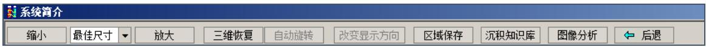

text_image

系统简介
缩小 最佳尺寸 放大 三维恢复 自动旋转 改变显示方向 区域保存 沉积知识库 图像分析 后退

图 1图象分析

选择对应的分析系统，如图2所示。

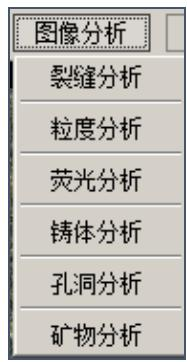

text_image

图像分析
裂缝分析
粒度分析
荧光分析
铸体分析
孔洞分析
矿物分析

图 2分析系统

选择对应的分析系统，打开分析系统界面。

这里我们主要依次讲解各个分析系统使用步骤。

步骤二：启动孔洞分析

首先进入岩心图文浏览界面，然后鼠标单击“图象分析”功能按钮，在弹出的菜单中选择孔洞分析即可，如图3所示。

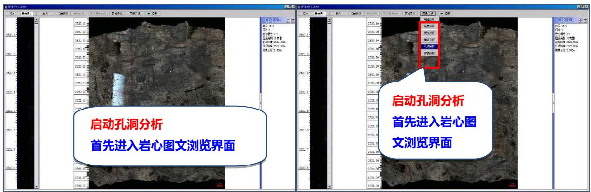

text_image

启动孔洞分析
首先进入岩心图文浏览界面
启动孔洞分析
首先进入岩心图
文浏览界面

图 3孔洞分析

步骤三：标尺选择

首先进行数据计算所需的标尺选择，鼠标单击“文件”菜单，选中“选择标尺”子

菜单进行孔洞分析标尺的选择，如图 4所示。

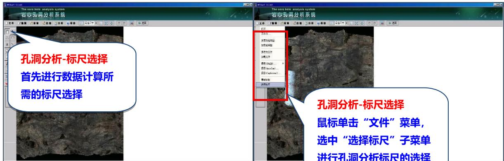

text_image

孔洞分析-标尺选择
首先进行数据计算所
需的标尺选择

孔洞分析-标尺选择
鼠标单击“文件”菜单，
选中“选择标尺”子菜单
进行孔洞分析标尺的选择

图 4标尺选择

这里标尺分为宏观、微观两种，宏观标尺单位为毫米，是以图象原始 DPI 计算而来；而微观标尺单位为微米，是根据物镜的不同人为进行相应设定的，在“文件”菜单“重新定标”子菜单中可以进行微观标尺的设定，用户可以根据图象类型进行相应的选择，这里勾选“宏观分析”，单击确定即可，如图5所示。

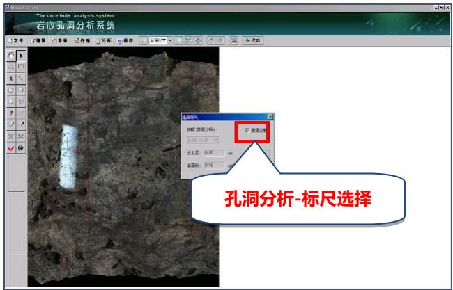

text_image

The core hole analysis system
若心孔洞分析系统
孔洞分析-标尺选择

图 5孔洞分析

步骤四：图象预处理

待标尺选择好之后，便可开发对岩心图象进行相关图象预处理操作了，主要目的就是加大孔洞区域与周边区域的色彩对比，为孔洞区域的提取奠定好的基础，如图6所示。

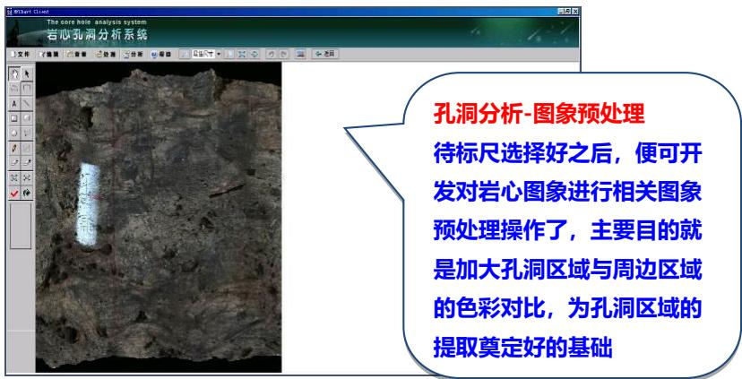

text_image

孔洞分析-图象预处理
待标尺选择好之后，便可开发对岩心图象进行相关图象预处理操作了，主要目的就是加大孔洞区域与周边区域的色彩对比，为孔洞区域的提取奠定好的基础

图6 图象预处理

鼠标单击“处理”菜单，在子菜单中有“色阶”、“曲线调节”、“亮度”、“对比度”、“灰度”、“饱和度”、“滤波”、“锐化”、“平滑”、“查找边缘”及“底片效果”等相关图象处理功能，用户可以根据实际情况进行选择，这里选择“自动色阶”处理，如图7所示。

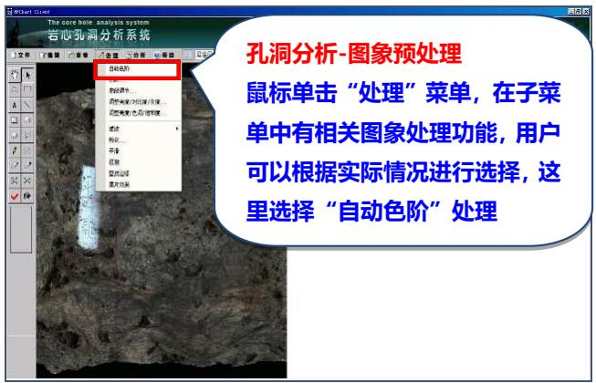

text_image

孔洞分析-图象预处理
鼠标单击“处理”菜单，在子菜单中有相关图象处理功能，用户可以根据实际情况进行选择，这里选择“自动色阶”处理

图 7孔洞分析

步骤五：孔洞提取

待图象预处理完成之后，便可以开始对孔洞的提取，鼠标单击“分析”菜单，选择“图象分割”，如图8所示。

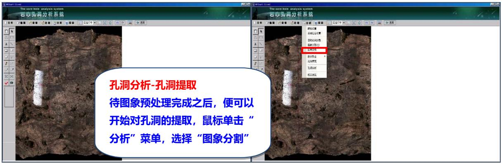

text_image

孔洞分析-孔洞提取
待图象预处理完成之后，便可以
开始对孔洞的提取，鼠标单击“
分析”菜单，选择“图象分割”

图 8孔洞提取

a鼠标单击“区域分割”功能按钮进行岩心图象上孔洞区域的提取（复选框“连续区域”表示分割区域只在当前选取点周围满足匹配条件的点进行提取，而非进行全图的扫描）。  
b “颜色匹配度”区域分割参数的调节，匹配度越小表明匹配的颜色集合越小，提取的颜色与选定的颜色越接近。  
c “当前颜色”实时显示区域分割鼠标当前位置对应图象上象素的颜色。  
d “反选”、“撤销”、“还原“分别实现区域反向提取、区域提取的撤销与图象还原，如图 9所示

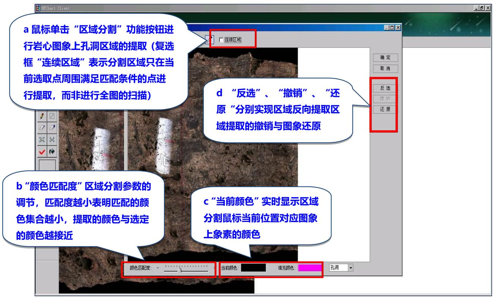

text_image

a 鼠标单击“区域分割”功能按钮进行岩心图象上孔洞区域的提取（复选框“连续区域”表示分割区域只在当前选取点周围满足匹配条件的点进行提取，而非进行全图的扫描）
d “反选”、“撤销”、“还原”分别实现区域反向提取区域提取的撤销与图象还原
b “颜色匹配度”区域分割参数的调节，匹配度越小表明匹配的颜色集合越小，提取的颜色与选定的颜色越接近
c “当前颜色”实时显示区域分割鼠标当前位置对应图象上像素的颜色
颜色匹配度： - 
当前颜色： 
填充颜色： 
孔洞

图9 撤销与图象还原

勾选“连续区域”功能，然后进行孔洞区域的分割处理。待图象上的孔洞全部完成区域分割处理之后，单击“确定”功能按钮保存即可，如图10所示。

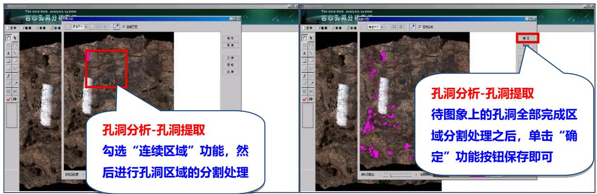

text_image

孔洞分析-孔洞提取
勾选“连续区域”功能，然后进行孔洞区域的分割处理
孔洞分析-孔洞提取
待图象上的孔洞全部完成区
域分割处理之后，单击“确
定”功能按钮保存即可

图 10“连续区域”

步骤六：二次编辑

孔洞提取区域的“二次编辑”处理根据处理的区域对象的范围分为 2 种：“整理处理”和“单个处理”。“整体处理”主要是“分析”菜单下的相关图象处理子功能，如“图象去噪”、“孔洞填充”及“数学形态”图象处理，如图11所示。

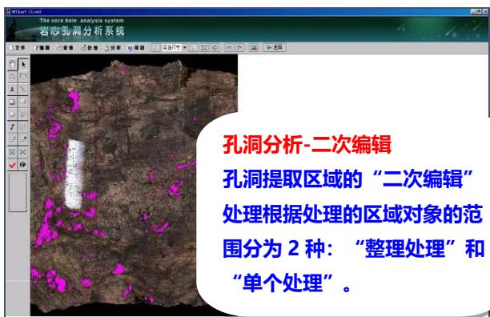

text_image

孔洞分析-二次编辑
孔洞提取区域的“二次编辑”
处理根据处理的区域对象的范围分为2种：“整理处理”和“单个处理”。

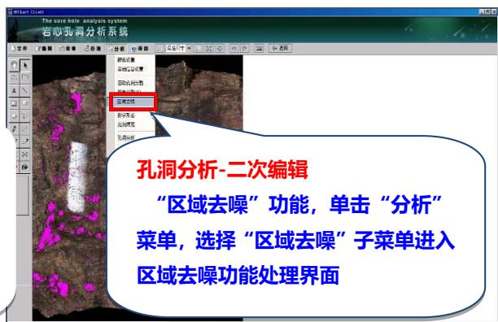

text_image

孔洞分析-二次编辑
“区域去噪”功能，单击“分析”
菜单，选择“区域去噪”子菜单进入
区域去噪功能处理界面

图 11 图象处理

首先来介绍“区域去噪”功能（备注：3种图象处理功能没有明确的先后关系，用户可根据实际情况进行相应的处理）单击“分析”菜单，选择“区域去噪”子菜单进入区域去噪功能处理界面。

a “区域去噪”待去除区域象素大小参数设置，有区域小于某一数值去除和区域大于某一数值的去除 2 种条件，用户根据实际情况进行选择. 这里去除掉区域小于 10 象素的孔洞区域，勾选“少于”复选框，并在编辑框输入 10，然后单击“去噪”功能按钮。  
b “去噪”功能按钮实现满足过滤条件的孔洞区域的去除。  
c “还原”、“撤销”功能按钮实现区域去噪操作处理的撤销与还原，如图 12 所示。

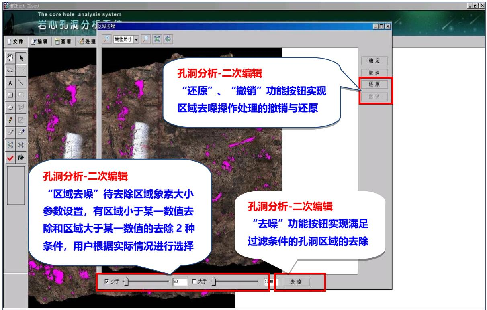

text_image

孔洞分析-二次编辑
“还原”、“撤销”功能按钮实现
区域去噪操作处理的撤销与还原

孔洞分析-二次编辑
“区域去噪”待去除区域像素大小
参数设置，有区域小于某一数值去
除和区域大于某一数值的去除2种
条件，用户根据实际情况进行选择

孔洞分析-二次编辑
“去噪”功能按钮实现满足
过滤条件的孔洞区域的去除

☑ 少于 - 50 大于 100 去 喷

图 12 图象处理

接来下运用数学形态图象处理方法来对孔洞提取区域进行调整完善，单击“分析”菜单，选择“数学形态”子菜单下的“区域膨胀”、“区域腐蚀”菜单即可。

“区域膨胀”按照用户指定方向实现孔洞提取区域的膨胀，待反向确定后，单击“预览”功能按钮可以查看区域膨胀后的效果图，多次“预览”膨胀效果依次叠加，如确定无误后，单击“确定”功能按钮进行保存即可，如图13所示。

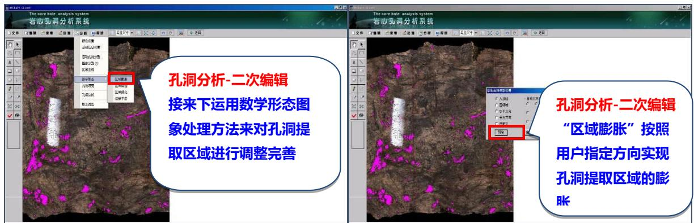

text_image

孔洞分析-二次编辑
接来下运用数学形态图
象处理方法来对孔洞提
取区域进行调整完善
孔洞分析-二次编辑
“区域膨胀” 按照
用户指定方向实现
孔洞提取区域的膨
胀

图 13 图象处理

“区域腐蚀”按照用户指定方向实现孔洞提取区域的腐蚀（操作同区域膨胀）。

步骤七：孔洞填充

“孔洞填充”根据用户设置实现孔洞填充区域内的孔洞填充处理。“孔洞填充”待 填充孔洞区域大小范围确定后，单击“预览”功能按钮进行孔洞填充效果浏览，确认无 误后单击“确定”功能按钮进行存储即可，如图 14所示。

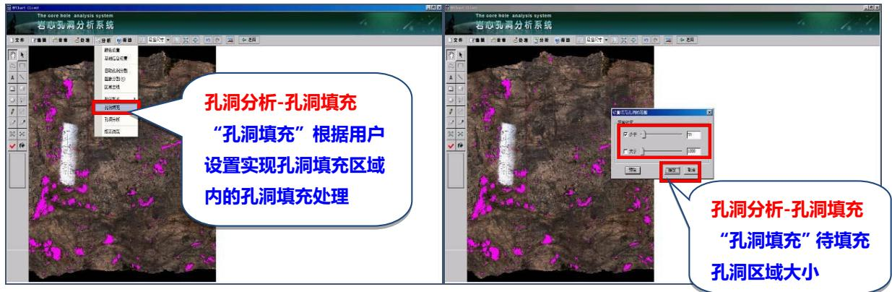

text_image

孔洞分析-孔洞填充
“孔洞填充”根据用户
设置实现孔洞填充区域
内的孔洞填充处理

孔洞分析-孔洞填充
“孔洞填充”待填充
孔洞区域大小

图 14 孔洞填充

接下来介绍孔洞提取区域二次编辑的“单个处理”方式，主要运用快捷工具按钮进行区域的编辑完善。 快捷工具按钮比较常用的有橡皮擦(清除与增加)、局部区域膨胀与腐蚀和区域分割这些工具，如图15所示。

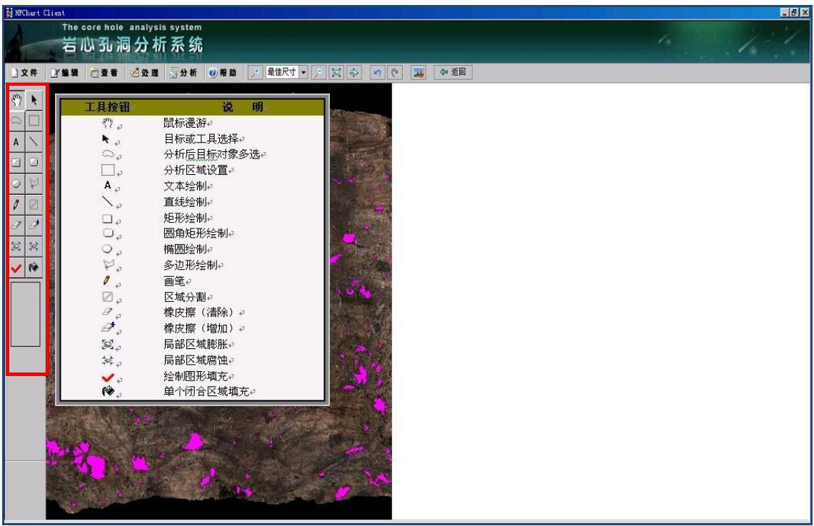

text_image

The core hole analysis system
岩心孔洞分析系统
文件 编辑 查看 处理 分析 帮助 最佳尺寸 返回
工具按钮 说明
鼠标漫游
目标或工具选择
分析后目标对象多选
分析区域设置
文本绘制
直线绘制
矩形绘制
圆角矩形绘制
椭圆绘制
多边形绘制
画笔
区域分割
橡皮擦（清除）
橡皮擦（增加）
局部区域膨胀
局部区域腐蚀
绘制图形填充
单个闭合区域填充

图 15 单个处理

图 15 单个处理“图层显示”快捷工具实现原图与孔洞提取效果图之间的切换浏览。首先切换浏览比例进行原图 1:1 浏览，然后拖动滚动条找到待完善的孔洞区域，接着运用快捷工具进行编辑，直到效果满意为止。

选择橡皮擦样式，然后进行孔洞填充区域的调整。待孔洞提取区域调整完善后便可进行孔洞提取区域的分析处理，如图 16所示。

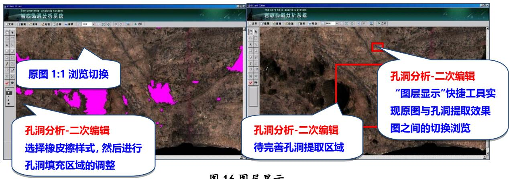

text_image

原图 1:1 浏览切换
孔洞分析-二次编辑
选择橡皮擦样式, 然后进行
孔洞填充区域的调整
孔洞分析-二次编辑
待完善孔洞提取区域
孔洞分析-二次编辑
“图层显示”快捷工具实
现原图与孔洞提取效果
图之间的切换浏览
图 16 图层显示

图 16 图层显示

步骤八：孔洞分析与特征参数设置

单击“分析”菜单选择“孔洞分析”子菜单功能即可。

待“孔洞分析”处理完成之后，每个孔洞提取区域会有个对应的孔洞序号，接下来就是对每个孔洞进行相关特征参数的设置，如图 17所示。

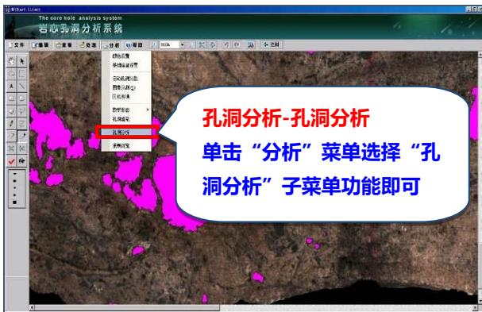

text_image

孔洞分析-孔洞分析
单击“分析”菜单选择“孔洞分析”子菜单功能即可

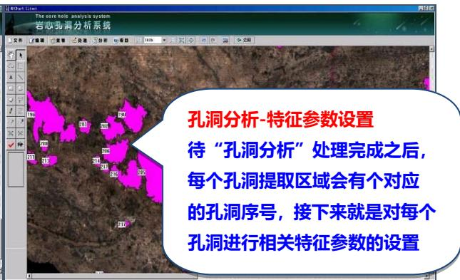

text_image

孔洞分析-特征参数设置
待“孔洞分析”处理完成之后，
每个孔洞提取区域会有个对应的孔洞序号，接下来就是对每个孔洞进行相关特征参数的设置

图 17 孔洞分析

1.鼠标单击快捷工具栏上的“选择工具”；  
2.鼠标单击孔洞提取区域进行孔洞的选择；  
3.在孔洞基本信息设置界面进行相关特征参数的设置，如图18所示。

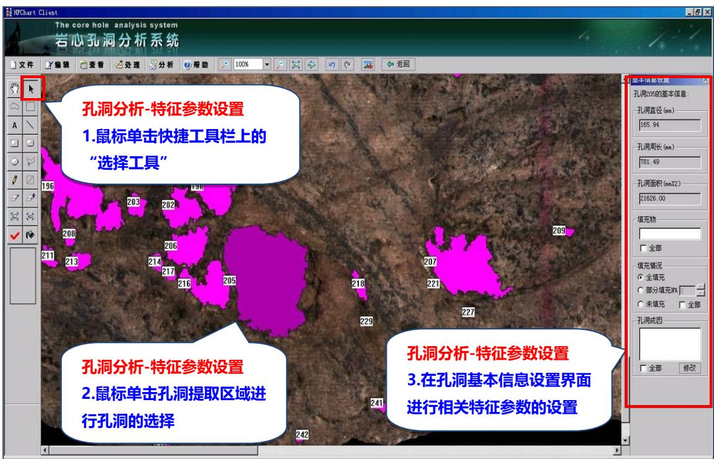

text_image

HPChart Client
The core hole analysis system
岩心孔洞分析系统
文件  编辑  查看  处理  分析  帮助  100%  返回
孔洞分析-特征参数设置
1.鼠标单击快捷工具栏上的
“选择工具”
孔洞分析-特征参数设置
2.鼠标单击孔洞提取区域进
行孔洞的选择
孔洞分析-特征参数设置
3.在孔洞基本信息设置界面
进行相关特征参数的设置

图 18 孔洞分析

用户也可以通过选择“快捷工具栏”上的“多选分析对象”功能进行孔洞的圈选，或者按住Shift键进行多选，然后对这些选中的孔洞进行统一的参数设置，如图19所示。

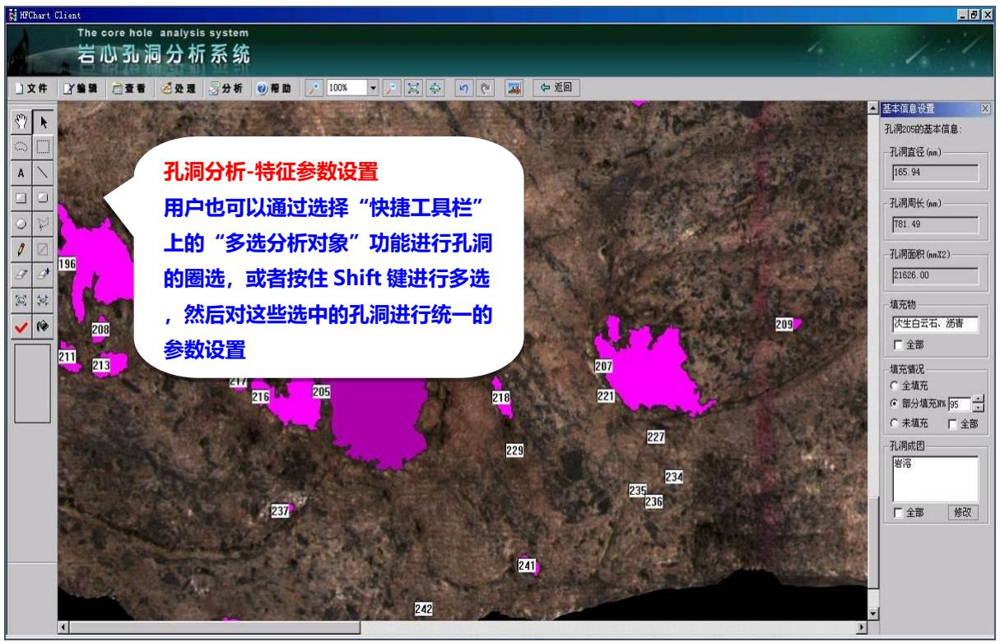

text_image

孔洞分析-特征参数设置
用户也可以通过选择“快捷工具栏”
上的“多选分析对象”功能进行孔洞
的圈选，或者按住 Shift 键进行多选
，然后对这些选中的孔洞进行统一的
参数设置

图 19 孔洞分析

待孔洞特征参数设置完之后单击“修改”功能按钮即可实现数据的保存，如图 20 所示。

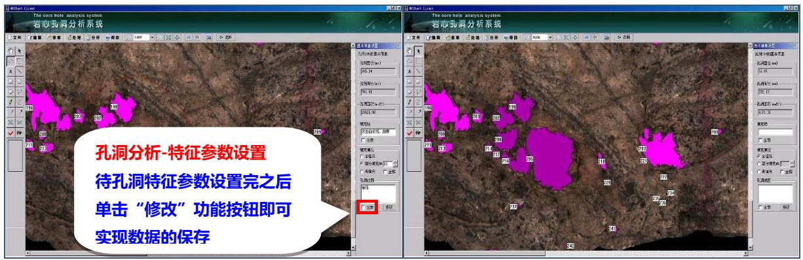

text_image

孔洞分析-特征参数设置
待孔洞特征参数设置完之后
单击“修改”功能按钮即可
实现数据的保存

图 20 孔洞分析

步骤九： 基础信息设置

待孔洞分析完成之后便可进行孔洞图象基础信息的设置，如图21所示。

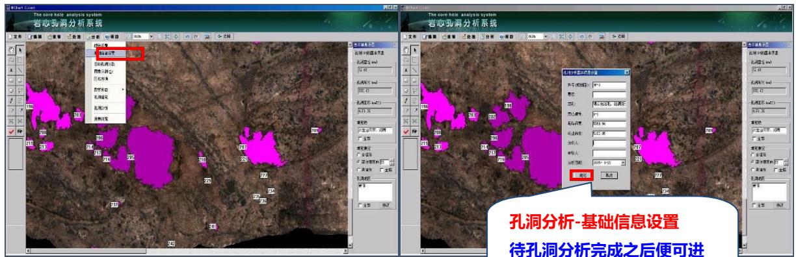

text_image

The core hole analysis system
若心劲洞分析系统
孔洞分析-基础信息设置
待孔洞分析完成之后便可进

图 21 孔洞分析

行孔洞图象基础信息的设置

步骤十：报告浏览

待孔洞分析、基础信息设置之后便可进行孔洞分析的报表浏览，如图 22所示。

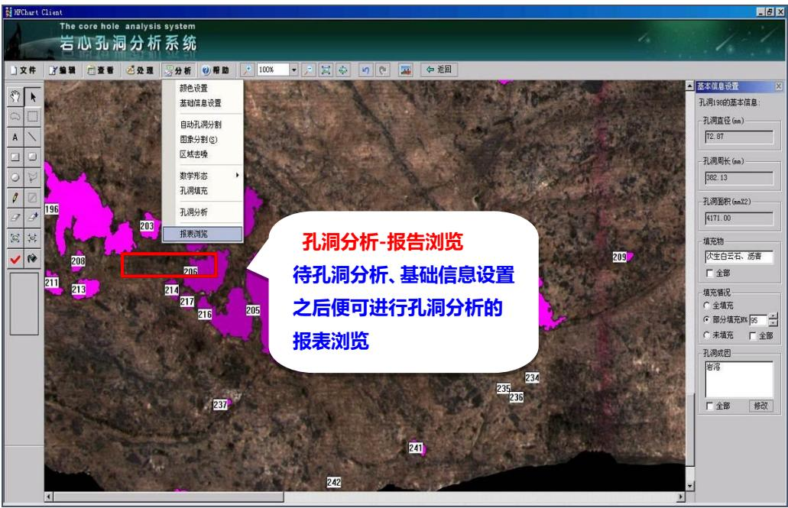

text_image

孔洞分析-报告浏览
待孔洞分析、基础信息设置
之后便可进行孔洞分析的
报表浏览

图 22 孔洞分析

生成分析报告，如图 23所示。

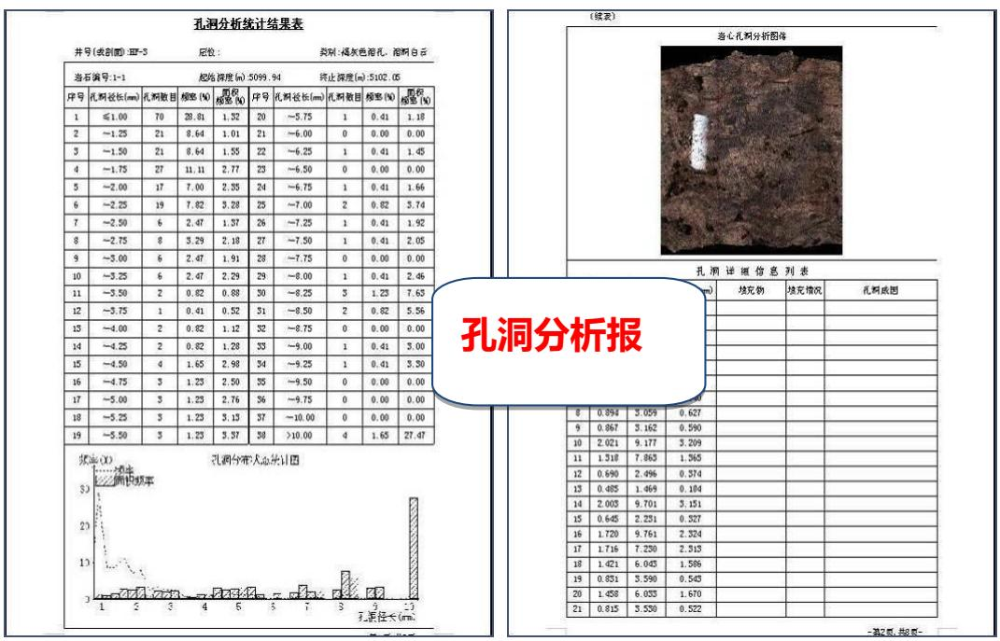  
图23 孔洞分析报告